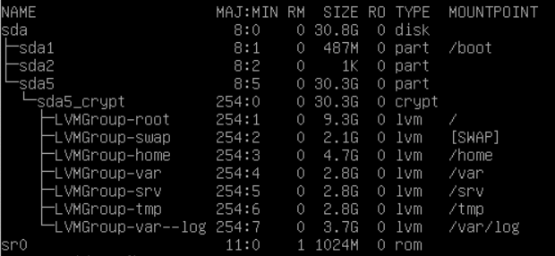

# **Today I lerned(TIL):**
## 31.08.2021
* learned basic knowledge about [markdown](https://guides.hexlet.io/markdown/), [HTML](https://ru.code-basics.com/languages/html) and [CSS](https://ru.code-basics.com/languages/css)
## 1.09.2021
* I studied the [directory tree in Linux](https://stepik.org/course/762/syllabus), how work with files and their contents
## 2.09.2021
* I started studying [Ansible](https://www.ansible.com/), what it is, what it is used for
## 3.09.2021
* I learned how to create and run simple applications using the Flask framework
## 4.09.2021
* I studied control operators in terminal, environment variables, embedding of command shells
## 5.09.2021
* I lerned how to process requests in the flask and respond to them
## 6.09.2021
* I found out what features Ansible has, and analyzed simple examples of its use for configuration
## 7.09.2021
* I learned how to install debian 10.10 on a VM and create an crypted LVM volume 
## 8.09.2021
* Understood how pipes work in the terminal, how they work together with redirects
