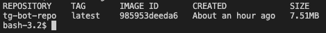

## Telegramm bot
### Status OK
### Deadline - October 1, 2021
## subject [here](./subject.md)

## How to use:
Find in tg ```@avchar_anderson_task_status_bot```. Start with ```help```.

## How to build tg_bot
```Fill in the line TG_TOKEN in main.go, also you can change GIT_REPO and GIT_TREE```
build Docker-container:
```
docker build -t tg_bot .
```
run container:
```
docker run -it --rm tg_bot
```
delete docker image:
```
docker rmi tg_bot
```

### Docker container size:

