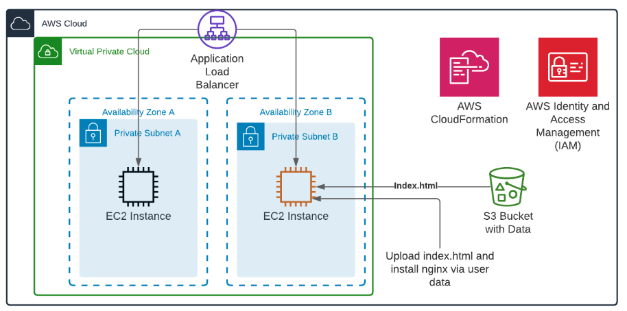

## AWS Cloud
## Deadline
## subject [here](./subject.md)
**Write AWS CloudFormation template for diagram**

**BONUS**
* for AWS impruve diagram and add missed blocks
* add func auto recovery
* write a script and add the ability to run different ENVs with different parameters
